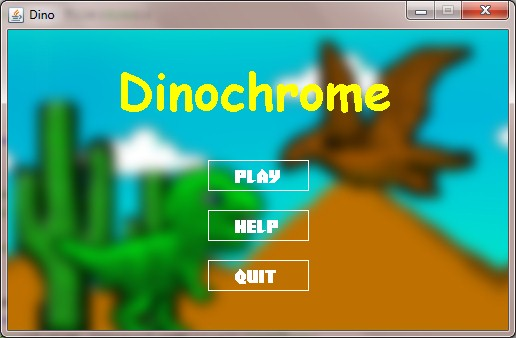
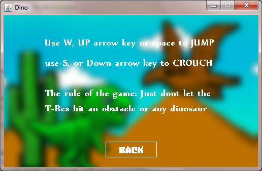
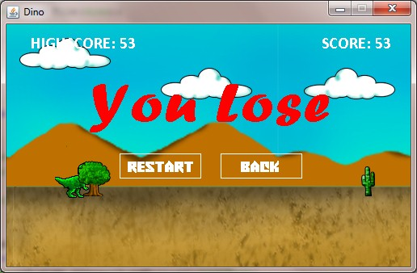
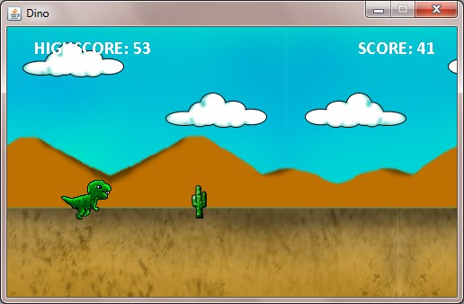

# DinoChrome

This game is made using netbeans IDE inspired by the google chrome's jumping dinosaur, I'ts an upgraded version considered as version 2

### IDE's

    This is a list of software's or IDE where you could run this game

>Netbeans
>Eclipse IDE
>Any java IDE's

### Installation
    1.  In netbeans IDE, save them in a folder and save it on your netbeans project where you could access it easily or save them anywhere you want
    2.  Click open projects.
    3.  Click the project and test it on your IDE

The main class is located in dev.agpoon.dino named Launcher.java, run the file and the game should start..

## Authors

* **Rudolph John Agpoon**

## License

This project is not a part of Google, it is just made for practice and educational purposes only

## Acknowledgments (Youtube Tutorial's where I learned this

* RealTutsGml
* CodenMore
* My Friend Joeben Paul
